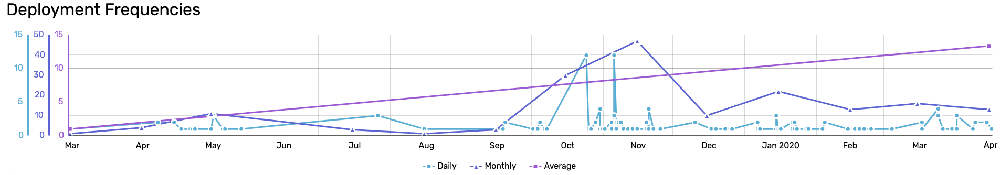

<p align="center">
  <a href="#">
    
  </a>
</p>

<h1 align="center">
  four-key Metrics
</h1>

<p align="center">
  four-key is a measure tool written with golang for your repositories. This project inspired from <a href="https://itrevolution.com/book/accelerate/">Accelerate</a> book.
  <br></br>
  <a href="https://www.thoughtworks.com/radar/techniques/four-key-metrics">Thoughtworks Technology Radar</a>
</p>

<p align="center">
  <a href="#" target="_blank">Documentation on Gitbook 🔗</a>
</p>

<p align="center">
  <a href="#"></a>
  <a href="https://travis-ci.org/{user}/{repository-name}"></a>
</p>

This package provides cli-tool for your commits. You can measure lead time, deployment frequency, mean time to restore (MTTR) and change fail percentage of your repositories. If you want to contribute this package, please fork and [create](https://github.com/{user}/{repository-name}/pulls) a pull request.

# Dependencies
* git

# Prerequisites
<br>
    <ul>
    <li>All releases must be tagged with a specific prefix and version number  [prefix][versionNumber]  like release-v15 or v-[commitSha] or rel12</li>
    <li>Must be provided with -p yourTagPattern while adding repository OR add to config.json </li>
    <li>All fixes must be specific like fix - hotfix - hot-fix </li>
    <li>Must be provided with -c yourFixCommitPattern -c yourOtherCommitFixPattern -c yourOtherCommitFixPattern while adding repository OR add to config.json </li>
    </ul>
   

# Installation

Executables

* Mac 64-bit: https://github.com/trendyol/
* Linux 64-bit: https://github.com/trendyol/
* Windows 64-bit: https://github.com/trendyol/

```
Source Code Build
$ git clone https://github.com/Trendyol/four-key.git && cd four-key
$ go build
```

# Preparation
````cli
// Add repository with CLI
// OR Add repository with configuration file - Sample config.json
{
    "repositories":[
        {
            "teamName":"cs",
            "cloneAddress": "https://github.com/Trendyol/reponame",
            "releaseTagPattern": "v-",
            "fixCommitPatterns": ["fix","hot-fix","hotfix"]
        }
    ]
}

````
[](https://asciinema.org/a/MHuwLNKOT9mifuCKPfy2QIUD9)
````
add command usage

$ four-key add [flags]

Flags:
  -c, --cloneAddress string             Set your clone address
  -f, --fixCommitPatterns stringArray   Set your fix commit patterns of repository
  -h, --help                            help for add
  -r, --releaseTagPattern string        Set your release tag pattern of repository
  -t, --team string                     Set your team of repository

````

````
list command usage

$ four-key list [flags]

Flags:
  -h, --help                help for remove

````

````
remove command usage

$ four-key remove [flags]

Flags:
  -h, --help                help for remove
  -r, --repository string   Set your repository name to remove from config

````

[](https://asciinema.org/a/dqIcYF1HXSIscgRdy2zkPOaUq)

````
set command usage

Usage:
  four-key set [flags]

Flags:
  -h, --help            help for set
  -o, --output string   Set output source of 4Key metric results
````

# Generate
````
$ four-key run --startDate 2018-01-13 --endDate 2020-01-30

Usage:
  four-key run [flags]

Flags:
  -e, --endDate string      Set a end date of range
  -h, --help                help for run
  -r, --repository string   Set a name of the specific repository
  -s, --startDate string    Set a start date of range

````

[](https://asciinema.org/a/XSWFQHdyz8rnaSG7VUqpoaa8F)

# TODO
* Add calculation descriptions for all metrics (In Progress)
* Add brew & scoop as installation options (In Progress)
* Complete tests (In Progress)
* Add CI
* Complete Charts
* Add suggestions for metrics results

# License
The MIT License (MIT) - see [`LICENSE.md`](https://github.com/Trendyol/four-key/LICENSE.md) for more details